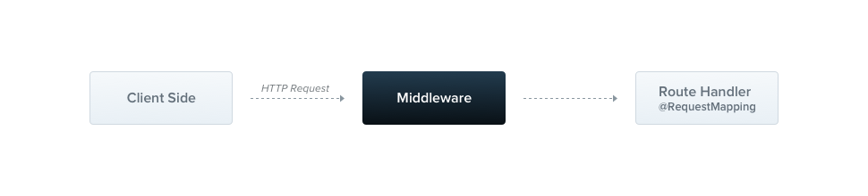

Rest的缺点:REST接口时返回的数据格式、数据类型都是后端预先定义好的，如果返回的数据格式并不是调用者所期望的，调用者在处理上比较麻烦！

GraphQL不能像REST那样轻易地对HTTP结果进行缓存。

GraphQL是一种新的API标准，它提供了一种更高效、强大和灵活的数据提供方式。它是由Facebook开发和开源，目前由来自世界各地的大公司和个人维护。GraphQL本质上是一种基于api的查询语言，现在大多数应用程序都需要从服务器中获取数据，这些数据存储可能存储在数据库中，API的职责是提供与应用程序需求相匹配的存储数据的接口。有的人经常把GraphQL和数据库技术相混淆，这是一个误解，GraphQL是api的查询语言，而不是数据库。从这个意义上说，它是数据库无关的，而且可以在使用API的任何环境中有效使用，我们可以理解为GraphQL是基于API之上的一层封装，目的是为了更好，更灵活的适用于业务的需求变化。 

1.移动端用户的爆发式增长需要更高效的数据加载

Facebook开发GraphQL的最初原因是移动用户的增加、低功耗设备和松散的网络。GraphQL最小化了需要网络传输的数据量，从而极大地改善了在这些条件下运行的应用程序。

2.各种不同的前端框架和平台

前端框架和平台运行客户端应用程序的异构环境使得我们在构建和维护一个符合所有需求的API变得困难，使用GraphQL每个客户机都可以精确地访问它需要的数据。

3.在不同前端框架，不同平台下想要加快产品快速开发变的越来越难

持续部署已经成为许多公司的标准，快速的迭代和频繁的产品更新是必不可少的。对于REST api，服务器公开数据的方式常常需要修改，以满足客户端的特定需求和设计更改。这阻碍了快速开发实践和产品迭代。

https://www.cnblogs.com/Wolfmanlq/p/9094418.html
https://www.cnblogs.com/rjzheng/p/10368210.html

# 控制器

控制器负责处理传入的 请求 和向客户端返回 响应 。


控制器的目的是接收应用的特定请求。路由机制控制哪个控制器接收哪些请求。通常，每个控制器有多个路由，不同的路由可以执行不同的操作。

为了创建一个基本的控制器，我们必须使用装饰器。装饰器将类与所需的元数据关联，并使 Nest 能够创建路由映射（将请求绑定到相应的控制器）。

# 提供者

提供程序是 Nest的一个基本概念。许多基本的 Nest类可能被视为提供者 - service,repository, factory, helper 等等。 他们都可以通过 constructor 注入依赖关系。 这意味着对象可以彼此创建各种关系，并且“连接”对象实例的功能在很大程度上可以委托给 Nest运行时系统。 提供者只是一个用 @Injectable()装饰器注释的类。


在前面的章节中，我们已经创建了一个简单的控制器 CatsController 。控制器应处理 HTTP 请求并将更复杂的任务委托给提供者。提供者是纯粹的 JavaScript 类，在其类声明之前带有 @Injectable()装饰器。

> 由于 Nest 可以以更多的面向对象方式设计和组织依赖性，因此我们强烈建议遵循 SOLID 原则。

# 模块

模块是具有 @Module() 装饰器的类。 @Module() 装饰器提供了元数据，Nest 用它来组织应用程序结构。


每个 Nest 应用程序至少有一个模块，即根模块。根模块是 Nest 开始安排应用程序树的地方。事实上，根模块可能是应用程序中唯一的模块，特别是当应用程序很小时，但是对于大型程序来说这是没有意义的。在大多数情况下，您将拥有多个模块，每个模块都有一组紧密相关的功能。

@module() 装饰器接受一个描述模块属性的对象：

providers	由 Nest 注入器实例化的提供者，并且可以至少在整个模块中共享
controllers	必须创建的一组控制器
imports	导入模块的列表，这些模块导出了此模块中所需提供者
exports	由本模块提供并应在其他模块中可用的提供者的子集。

默认情况下, 模块封装提供者。这意味着如果提供者即不是当前模块的一部分, 也不是从另外模块(已导入)导出的，那么它就是无法注入的。

# 中间件

中间件是在路由处理程序 之前 调用的函数。 中间件函数可以访问请求和响应对象，以及应用程序请求响应周期中的 next() 中间件函数。 next() 中间件函数通常由名为 next 的变量表示。



Nest 中间件实际上等价于 express 中间件。 下面是Express官方文档中所述的中间件功能：

中间件函数可以执行以下任务:

执行任何代码。
对请求和响应对象进行更改。
结束请求-响应周期。
调用堆栈中的下一个中间件函数。
如果当前的中间件函数没有结束请求-响应周期, 它必须调用 next() 将控制传递给下一个中间件函数。否则, 请求将被挂起。
您可以在函数中或在具有 @Injectable() 装饰器的类中实现自定义 Nest中间件。 这个类应该实现 NestMiddleware 接口, 而函数没有任何特殊的要求。 让我们首先使用类方法实现一个简单的中间件功能。

logger.middleware.ts

```base
import { Injectable, NestMiddleware } from '@nestjs/common';
import { Request, Response } from 'express';

@Injectable()
export class LoggerMiddleware implements NestMiddleware {
  use(req: Request, res: Response, next: Function) {
    console.log('Request...');
    next();
  }
}
```

# 守卫

守卫是一个使用 @Injectable() 装饰器的类。 守卫应该实现 CanActivate 接口。


守卫有一个单独的责任。它们根据运行时出现的某些条件（例如权限，角色，访问控制列表等）来确定给定的请求是否由路由处理程序处理。 这通常称为授权。在传统的 Express 应用程序中，通常由中间件处理授权。中间件是身份验证的良好选择。到目前为止，访问限制逻辑大多在中间件内。这样很好，因为诸如 token 验证或将 request 对象附加属性与特定路由没有强关联。

中间件不知道调用 next() 函数后会执行哪个处理程序。另一方面，警卫可以访问 ExecutionContext 实例，因此确切地知道接下来要执行什么。它们的设计与异常过滤器、管道和拦截器非常相似，目的是让您在请求/响应周期的正确位置插入处理逻辑，并以声明的方式进行插入。这有助于保持代码的简洁和声明性。

守卫在每个中间件之后执行，但在任何拦截器或管道之前执行。

# 拦截器

拦截器是使用 @Injectable() 装饰器注解的类。拦截器应该实现 NestInterceptor 接口。


拦截器具有一系列有用的功能，这些功能受面向切面编程（AOP）技术的启发。它们可以：

在函数执行之前/之后绑定额外的逻辑
转换从函数返回的结果
转换从函数抛出的异常
扩展基本函数行为
根据所选条件完全重写函数 (例如, 缓存目的)


# 管道

管道是具有 @Injectable() 装饰器的类。管道应实现 PipeTransform 接口。


管道有两个类型:

转换：管道将输入数据转换为所需的数据输出
验证：对输入数据进行验证，如果验证成功继续传递; 验证失败则抛出异常;
在这两种情况下, 管道 参数(arguments) 会由 控制器(controllers)的路由处理程序 进行处理. Nest 会在调用这个方法之前插入一个管道，管道会先拦截方法的调用参数,进行转换或是验证处理，然后用转换好或是验证好的参数调用原方法。

管道在异常区域内运行。这意味着当抛出异常时，它们由核心异常处理程序和应用于当前上下文的 异常过滤器 处理。当在 Pipe 中发生异常，controller 不会继续执行任何方法。


# 异常过滤器

内置的异常层负责处理整个应用程序中的所有抛出的异常。当捕获到未处理的异常时，最终用户将收到友好的响应。


每个发生的异常都由全局异常过滤器处理, 当这个异常无法被识别时 (既不是 HttpException 也不是继承的类 HttpException ) , 用户将收到以下 JSON 响应:

```
{
    "statusCode": 500,
    "message": "Internal server error"
}
```

客户端请求 ---> 中间件 ---> 守卫 ---> 拦截器之前 ---> 管道 ---> 控制器处理并响应 ---> 拦截器之后 ---> 过滤器
