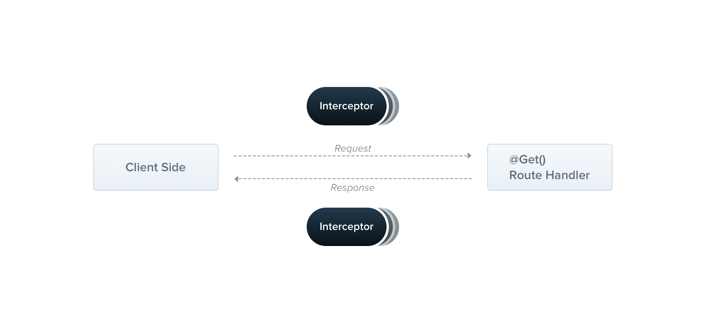

# Node

## Nest vs Egg

### Nest

Nest 是一个用于构建高效，可扩展的 Node.js 服务器端应用程序的框架。它使用渐进式 JavaScript，内置并完全支持 TypeScript（但仍然允许开发人员使用纯 JavaScript 编写代码）并结合了 OOP（面向对象编程），FP（功能编程）和 FRP（功能反应编程）的元素。

特性：

依赖注入容器
模块化封装
可测试性
内置支持 TypeScript

### Egg

为企业级框架和应用而生
奉行『约定优于配置』

特性：

提供基于 Egg 定制上层框架的能力
高度可扩展的插件机制
内置多进程管理
基于 Koa 开发，性能优异
框架稳定，测试覆盖率高
渐进式开发


> https://docs.nestjs.cn/
> https://eggjs.org/zh-cn/intro/

## TypeORM vs Sequelize

### TypeORM

为了减少使用任何数据库开始冒险所需的样板，Nest附带了随时可用的@nestjs/typeorm软件包。我们选择了TypeORM，因为它绝对是迄今为止最成熟的对象关系映射器（ORM）。由于它是用TypeScript编写的，因此它与Nest框架非常兼容。

### Sequelize

Sequelize 是一个基于 promise 的 Node.js ORM, 目前支持 Postgres, MySQL, SQLite 和 Microsoft SQL Server. 它具有强大的事务支持, 关联关系, 预读和延迟加载,读取复制等功能.

https://typeorm.io/#/
https://demopark.github.io/sequelize-docs-Zh-CN/

## GraphQL vs RESTful  

### GraphQL

GraphQL是一门为API和运行时而生的查询语言。它可以使用您已有的数据对这些查询进行填充。 GraphQL在您的API中，提供了一个完整的，易于理解的数据描述， 可以给予您的客户端一个权利，可以精确地描述他们所需要的数据，并不拖泥带水。 随着时间的推移，使得API的进化更加容易，并且开启强大的开发者工具。

### RESTful

RESTFUL是一种网络应用程序的设计风格和开发方式，基于HTTP，可以使用XML格式定义或JSON格式定义。RESTFUL适用于移动互联网厂商作为业务使能接口的场景，实现第三方OTT调用移动网络资源的功能，动作类型为新增、变更、删除所调用资源。

https://graphql.org.cn/


RESTful的一些不足
  ```
  1. 扩展性，单个RESTful接口返回数据越来越臃肿

  比如获取用户信息/users/:id，最初可能只有id、昵称，但随着需求的变化，用户所包含的字段可能会越来越多，年龄、性别、头像、经验、等级，等等。

  而具体到某个前端页面，可能只需要其中一小部分数据，这样就会增加网络传输量，前端获取了大量不必要的数据。

  2. 某个前端展现，实际需要调用多个独立的RESTful API才能获取到足够的数据

  比如一个文章详情页，最初可能只需要文章内容，那么前端就调用/articles/:aid获取到文章内容来展现就行了

  但随着需求的演进，产品可能会希望加上作者信息（昵称、头像等），这时前端又需要在获取文章详情后，根据其中的作者id字段继续获取作者相关的信息，/user/:uid

  然后，需求又变化了，产品希望在加上这篇文章的评论，这时前端需要继续调用/comment/:aid来拉取评论列表

  对于Web前端而言，由于ajax技术的存在，这种的请求数据方式，也就开发上稍微麻烦些，并不会造成太大的问题；但对于App来说，渲染的方式不同，必须要拉取的全部的数据之后，才能绘制界面，就会导致这个界面必须要等到所有3个RESTful接口的返回数据都拿到，才能进行绘制。
```

GraphQL优点

```
1. 所见即所得

查询的返回结果就是输入的查询结构的精确映射

2. 减少网络请求次数

如果设计的数据结构是从属的，直接就能在查询语句中指定;即使数据结构是独立的，也可以在查询语句中指定上下文，只需要一次网络请求，就能获得资源和子资源的数据。

3. 代码即文档

GraphQL会把schema定义和相关的注释生成可视化的文档，从而使得代码的变更，直接就反映到最新的文档上，避免RESTful中手工维护可能会造成代码、文档不一致的问题。

4. 参数类型强校验

RESTful方案本身没有对参数的类型做规定，往往都需要自行实现参数的校验机制，以确保安全。

但GraphQL提供了强类型的schema机制，从而天然确保了参数类型的合法性。
```
GraphQL适用场景
从Facebook最初开发GraphQL的目的，和笔者实际使用的情况而言，GraphQL还是存在一些缺点的，完全替代RESTful作为一种新的接口规范还有些为时过早。

GraphQL作为RESTful的一种辅助工具，尤其是针对前端App在复杂页面，本来要调用有上下文关系的多次RESTful请求时，采用GraphQL，只需要一次请求，就可以拿回所需的全部数据（有点JSON直出的意思），还是可以起到非常好的效果，大大提升App的性能。

作者：全栈弄潮儿
链接：https://www.jianshu.com/p/9359188b952f
来源：简书
著作权归作者所有。商业转载请联系作者获得授权，非商业转载请注明出处。


Rest的缺点:REST接口时返回的数据格式、数据类型都是后端预先定义好的，如果返回的数据格式并不是调用者所期望的，调用者在处理上比较麻烦！

GraphQL不能像REST那样轻易地对HTTP结果进行缓存。

GraphQL是一种新的API标准，它提供了一种更高效、强大和灵活的数据提供方式。它是由Facebook开发和开源，目前由来自世界各地的大公司和个人维护。GraphQL本质上是一种基于api的查询语言，现在大多数应用程序都需要从服务器中获取数据，这些数据存储可能存储在数据库中，API的职责是提供与应用程序需求相匹配的存储数据的接口。有的人经常把GraphQL和数据库技术相混淆，这是一个误解，GraphQL是api的查询语言，而不是数据库。从这个意义上说，它是数据库无关的，而且可以在使用API的任何环境中有效使用，我们可以理解为GraphQL是基于API之上的一层封装，目的是为了更好，更灵活的适用于业务的需求变化。 

1.移动端用户的爆发式增长需要更高效的数据加载

Facebook开发GraphQL的最初原因是移动用户的增加、低功耗设备和松散的网络。GraphQL最小化了需要网络传输的数据量，从而极大地改善了在这些条件下运行的应用程序。

2.各种不同的前端框架和平台

前端框架和平台运行客户端应用程序的异构环境使得我们在构建和维护一个符合所有需求的API变得困难，使用GraphQL每个客户机都可以精确地访问它需要的数据。

3.在不同前端框架，不同平台下想要加快产品快速开发变的越来越难

持续部署已经成为许多公司的标准，快速的迭代和频繁的产品更新是必不可少的。对于REST api，服务器公开数据的方式常常需要修改，以满足客户端的特定需求和设计更改。这阻碍了快速开发实践和产品迭代。

https://www.cnblogs.com/Wolfmanlq/p/9094418.html
https://www.cnblogs.com/rjzheng/p/10368210.html


# NEST

# 控制器

控制器负责处理传入的 请求 和向客户端返回 响应 。


控制器的目的是接收应用的特定请求。路由机制控制哪个控制器接收哪些请求。通常，每个控制器有多个路由，不同的路由可以执行不同的操作。

为了创建一个基本的控制器，我们必须使用装饰器。装饰器将类与所需的元数据关联，并使 Nest 能够创建路由映射（将请求绑定到相应的控制器）。

# 提供者

提供程序是 Nest的一个基本概念。许多基本的 Nest类可能被视为提供者 - service,repository, factory, helper 等等。 他们都可以通过 constructor 注入依赖关系。 这意味着对象可以彼此创建各种关系，并且“连接”对象实例的功能在很大程度上可以委托给 Nest运行时系统。 提供者只是一个用 @Injectable()装饰器注释的类。


在前面的章节中，我们已经创建了一个简单的控制器 CatsController 。控制器应处理 HTTP 请求并将更复杂的任务委托给提供者。提供者是纯粹的 JavaScript 类，在其类声明之前带有 @Injectable()装饰器。

> 由于 Nest 可以以更多的面向对象方式设计和组织依赖性，因此我们强烈建议遵循 SOLID 原则。

# 模块

模块是具有 @Module() 装饰器的类。 @Module() 装饰器提供了元数据，Nest 用它来组织应用程序结构。


每个 Nest 应用程序至少有一个模块，即根模块。根模块是 Nest 开始安排应用程序树的地方。事实上，根模块可能是应用程序中唯一的模块，特别是当应用程序很小时，但是对于大型程序来说这是没有意义的。在大多数情况下，您将拥有多个模块，每个模块都有一组紧密相关的功能。

@module() 装饰器接受一个描述模块属性的对象：

providers	由 Nest 注入器实例化的提供者，并且可以至少在整个模块中共享
controllers	必须创建的一组控制器
imports	导入模块的列表，这些模块导出了此模块中所需提供者
exports	由本模块提供并应在其他模块中可用的提供者的子集。

默认情况下, 模块封装提供者。这意味着如果提供者即不是当前模块的一部分, 也不是从另外模块(已导入)导出的，那么它就是无法注入的。

# 中间件

中间件是在路由处理程序 之前 调用的函数。 中间件函数可以访问请求和响应对象，以及应用程序请求响应周期中的 next() 中间件函数。 next() 中间件函数通常由名为 next 的变量表示。


Nest 中间件实际上等价于 express 中间件。 下面是Express官方文档中所述的中间件功能：

中间件函数可以执行以下任务:

执行任何代码。
对请求和响应对象进行更改。
结束请求-响应周期。
调用堆栈中的下一个中间件函数。
如果当前的中间件函数没有结束请求-响应周期, 它必须调用 next() 将控制传递给下一个中间件函数。否则, 请求将被挂起。
您可以在函数中或在具有 @Injectable() 装饰器的类中实现自定义 Nest中间件。 这个类应该实现 NestMiddleware 接口, 而函数没有任何特殊的要求。 让我们首先使用类方法实现一个简单的中间件功能。

logger.middleware.ts

```base
import { Injectable, NestMiddleware } from '@nestjs/common';
import { Request, Response } from 'express';

@Injectable()
export class LoggerMiddleware implements NestMiddleware {
  use(req: Request, res: Response, next: Function) {
    console.log('Request...');
    next();
  }
}
```

# 守卫

守卫是一个使用 @Injectable() 装饰器的类。 守卫应该实现 CanActivate 接口。


守卫有一个单独的责任。它们根据运行时出现的某些条件（例如权限，角色，访问控制列表等）来确定给定的请求是否由路由处理程序处理。 这通常称为授权。在传统的 Express 应用程序中，通常由中间件处理授权。中间件是身份验证的良好选择。到目前为止，访问限制逻辑大多在中间件内。这样很好，因为诸如 token 验证或将 request 对象附加属性与特定路由没有强关联。

中间件不知道调用 next() 函数后会执行哪个处理程序。另一方面，警卫可以访问 ExecutionContext 实例，因此确切地知道接下来要执行什么。它们的设计与异常过滤器、管道和拦截器非常相似，目的是让您在请求/响应周期的正确位置插入处理逻辑，并以声明的方式进行插入。这有助于保持代码的简洁和声明性。

守卫在每个中间件之后执行，但在任何拦截器或管道之前执行。

# 拦截器

拦截器是使用 @Injectable() 装饰器注解的类。拦截器应该实现 NestInterceptor 接口。



拦截器具有一系列有用的功能，这些功能受面向切面编程（AOP）技术的启发。它们可以：

在函数执行之前/之后绑定额外的逻辑
转换从函数返回的结果
转换从函数抛出的异常
扩展基本函数行为
根据所选条件完全重写函数 (例如, 缓存目的)


# 管道

管道是具有 @Injectable() 装饰器的类。管道应实现 PipeTransform 接口。


管道有两个类型:

转换：管道将输入数据转换为所需的数据输出
验证：对输入数据进行验证，如果验证成功继续传递; 验证失败则抛出异常;
在这两种情况下, 管道 参数(arguments) 会由 控制器(controllers)的路由处理程序 进行处理. Nest 会在调用这个方法之前插入一个管道，管道会先拦截方法的调用参数,进行转换或是验证处理，然后用转换好或是验证好的参数调用原方法。

管道在异常区域内运行。这意味着当抛出异常时，它们由核心异常处理程序和应用于当前上下文的 异常过滤器 处理。当在 Pipe 中发生异常，controller 不会继续执行任何方法。


# 异常过滤器

内置的异常层负责处理整个应用程序中的所有抛出的异常。当捕获到未处理的异常时，最终用户将收到友好的响应。


每个发生的异常都由全局异常过滤器处理, 当这个异常无法被识别时 (既不是 HttpException 也不是继承的类 HttpException ) , 用户将收到以下 JSON 响应:

```
{
    "statusCode": 500,
    "message": "Internal server error"
}
```

客户端请求 ---> 中间件 ---> 守卫 ---> 拦截器之前 ---> 管道 ---> 控制器处理并响应 ---> 拦截器之后 ---> 过滤器

中间件=>守卫=>拦截器=>请求开始=====请求完成=>拦截器=>中间件


nest g controller cats
nest g service cats
nest g module cats


一、概述
Nest是一个用于构建高效，可扩展的Node.js服务器端应用程序的框架。它使用渐进式JavaScript，使用TypeScript构建（保留与纯JavaScript的兼容性），并结合了OOP（面向对象编程），FP（功能编程）和FRP（功能反应编程）的元素。

二、NEST-CLI
nest.js 提供了 nest-cli 脚手架，方便快速新建新项目。
使用 nest-cli 构建基础项目：

$ npm i -g @nestjs/cli
$ nest new project-name
新建项目之后:

$ cd project
$ npm install
$ npm run start
三、先决条件
请确保您的操作系统上安装了 node.js（> = 8.9.0）。

四、基础项目分析

SRC
  app.controller.ts
  app.module.ts
  main.ts
main.ts 应用程序的条目文件。它用于NestFactory创建Nest应用程序实例。
app.module.ts 定义AppModule应用程序的根模块。
app.controller.ts 具有单一路线的基本控制器样本。

import { NestFactory } from '@nestjs/core';
import { ApplicationModule } from './app.module';

async function bootstrap() {
  const app = await NestFactory.create(ApplicationModule);
  await app.listen(3000);
}
bootstrap();
要创建Nest应用程序实例，我们正在使用NestFactory。NestFactory它是最基础的类之一，它公开了一些允许创建应用程序实例的静态方法。该create()方法返回一个实现INestApplication接口的对象，并提供一组可用的方法。

五、运行

npm run start
六、控制器（controller）
控制器负责处理传入的请求并将响应返回给客户端。
控制器的目的是接收应用程序的特定请求。在路由该控制器接收用于请求机构的控制。通常，每个控制器具有多个路由，并且不同的路由可以执行不同的动作。

为了创建一个基本的控制器，我们使用类和装饰器。装饰器将类与所需的元数据相关联，并使Nest能够创建路由映射（将请求绑定到相应的控制器）。

在下面的示例中，我们将使用定义基本控制器所需的 @Controller()装饰器。我们将指定一个可选的前缀。在Controller装饰器中使用前缀允许我们避免在路径可能共享公共前缀时重复自己。

cats.controller.ts

import { Controller, Get } from '@nestjs/common';

@Controller('cats')
export class CatsController {
  @Get()
  findAll() {
    return 'This action returns all cats';
  }
}
可以使用CLI提供的快捷命令创建控制器:

$ nest g controller cats
所述@Get()的前装饰findAll()方法告诉NEST创建此特定路线路径的端点并映射到该处理程序的每个相应的请求。由于我们已经为每个route（cats）声明了一个前缀，因此Nest会将每个/catsGET请求映射到此方法。

请求对象

许多端点需要访问客户端请求详细信息。实际上，Nest使用特定于库（默认情况下为express）的请求对象。因此，我们可以强制Nest使用@Req()装饰器将请求对象注入到处理程序中。

cats.controller.ts

import { Controller, Get, Req } from '@nestjs/common';

@Controller('cats')
export class CatsController {
  @Get()
  findAll(@Req() request) {
    return 'This action returns all cats';
  }
}
可以使用专用的装饰器，例如@Body()or @Query()，它们是开箱即用的。

下面展示了nest装饰器对象express中对象的对应关系

nest装饰器	express 对象
@Request()	req
@Response()	res
@Next()	next
@Session()	req.session
@Param(param?: string)	req.params / req.params[param]
@Body(param?: string)	req.body / req.body[param]
@Query(param?: string)	req.query / req.query[param]
@Headers(param?: string)	req.headers / req.headers[param]
新增一个post接口：

cats.controller.ts

import { Controller, Get, Post } from '@nestjs/common';

@Controller('cats')
export class CatsController {
  @Post()
  create() {
    return 'This action adds a new cat';
  }

  @Get()
  findAll() {
    return 'This action returns all cats';
  }
}
路由通配符

@Get('ab*cd')
findAll() {
  return 'This route uses a wildcard';
}
上述路线路径匹配abcd，ab_cd，abecd，等等。

状态码
默认情况下，响应状态代码始终为200，但POST请求为201。我们可以通过@HttpCode(...)在处理程序级别添加装饰器来轻松更改此行为。

头
要指定自定义响应标头，您可以使用 @Header()装饰器或特定于库的响应对象。

路径参数
需要接受动态数据作为URL的一部分时，具有静态路径的路由无济于事。为了定义带参数的路径，我们可以直接在路径路径中特定路由参数

@Get(':id')
findOne(@Param() params) {
  console.log(params.id);
  return `This action returns a #${params.id} cat`;
}
async await
每个异步函数都必须返回一个Promise。这意味着您可以返回Nest能够自行解决的延迟值。

@Get()
async findAll(): Promise<any[]> {
  return [];
}
七、服务（service）
创建一个简单的CatsService provider开始。

cats.service.ts JS

import { Injectable } from '@nestjs/common';
import { Cat } from './interfaces/cat.interface';

@Injectable()
export class CatsService {
  private readonly cats: Cat[] = [];

  create(cat: Cat) {
    this.cats.push(cat);
  }

  findAll(): Cat[] {
    return this.cats;
  }
}
nest-cli提供的快捷命令：$ nest g service cats/cats

然后就可以把service引入到controller中使用

cats.controller.ts

import { Controller, Get, Post, Body } from '@nestjs/common';
import { CreateCatDto } from './dto/create-cat.dto';
import { CatsService } from './cats.service';
import { Cat } from './interfaces/cat.interface';

@Controller('cats')
export class CatsController {
  constructor(private readonly catsService: CatsService) {}

  @Post()
  async create(@Body() createCatDto: CreateCatDto) {
    this.catsService.create(createCatDto);
  }

  @Get()
  async findAll(): Promise<Cat[]> {
    return this.catsService.findAll();
  }
}
依赖注入

Nest是围绕通常称为依赖注入的强大设计模式构建的。

在Nest中，由于TypeScript功能，它非常容易管理依赖项，因为它们只是按类型解析，然后传递给控制器​​的构造函数：

constructor(private readonly catsService: CatsService) {}
之后将新建的cat service和cat controller引入app module

app.module.ts

import { Module } from '@nestjs/common';
import { CatsController } from './cats/cats.controller';
import { CatsService } from './cats/cats.service';

@Module({
  controllers: [CatsController],
  providers: [CatsService],
})
export class ApplicationModule {}
八、模块（module）
模块是用@Module()装饰器注释的类。的@Module()装饰提供了元数据

module示例

每个应用程序至少有一个模块，一个根模块。根模块是Nest开始安排应用程序树的地方。实际上，根模块可能是应用程序中唯一的模块，尤其是当应用程序很小的时候。然而，对于大型应用程序，它没有意义。在大多数情况下，您将拥有多个模块，每个模块都具有密切相关的功能集。

所述@Module()装饰采用单个对象，其属性描述该模块：

providers	将由Nest注入器实例化的提供程序，并且至少可以在此模块之间共享。
controllers	必须创建的控制器集
imports	导出此模块中所需的提供程序的导入模块列表
exports	其子集providers由此模块提供，并应在其他模块中可用
上一节中CatsController与CatsService属于同一应用程序域。我们将考虑将它们移动到一个特征模块，即CatsModule。

cats/ cats.module.ts

import { Module } from '@nestjs/common';
import { CatsController } from './cats.controller';
import { CatsService } from './cats.service';

@Module({
  controllers: [CatsController],
  providers: [CatsService],
})
export class CatsModule {}
nest-cli提供的快捷命令：$ nest g module cats

我们定义了cats.module.ts文件，然后将与此模块相关的所有内容移动到cats目录中。我们需要做的最后一件事是将此模块导入根模块ApplicationModule。

app.module.ts

import { Module } from '@nestjs/common';
import { CatsModule } from './cats/cats.module';

@Module({
  imports: [CatsModule],
})
export class ApplicationModule {}
模块重新导出

@Module({
  imports: [CommonModule],
  exports: [CommonModule],
})
export class CoreModule {}
全局模块

import { Module, Global } from '@nestjs/common';
import { CatsController } from './cats.controller';
import { CatsService } from './cats.service';

@Global()
@Module({
  controllers: [CatsController],
  providers: [CatsService],
  exports: [CatsService]
})
export class CatsModule {}
全局模块只能注册一次，注册之后，无需再次引用便可使用。

九、中间件
略
十、异常处理
略
。
。
。

N、数据库
Nest附带了随时可用的@nestjs/typeorm软件包TypeORM,官方说绝对是迄今为止最成熟的对象关系映射器（ORM）
安装依赖 $ npm install --save typeorm mysql
新建database文件夹
新建batabase.providers.ts

database.providers.ts

import { createConnection } from 'typeorm';

export const databaseProviders = [
  {
    provide: 'DbConnectionToken',
    useFactory: async () => await createConnection({
      type: 'mysql',
      host: 'localhost',
      port: 3306,
      username: 'root',
      password: 'root',
      database: 'test',
      entities: [
          __dirname + '/../**/*.entity{.ts,.js}',
      ],
      synchronize: true,
    }),
  },
];
新建database.module.ts

database.module.ts

import { Module } from '@nestjs/common';
import { databaseProviders } from './database.providers';

@Module({
  providers: [...databaseProviders],
  exports: [...databaseProviders],
})
export class DatabaseModule {}
存储库模式
新建photo文件夹
新建photo.entity.ts

photo/ photo.entity.ts

import { Entity, Column, PrimaryGeneratedColumn } from 'typeorm';

@Entity()
export class Photo {
  @PrimaryGeneratedColumn()
  id: number;

  @Column({ length: 500 })
  name: string;

  @Column('text')
  description: string;

  @Column()
  filename: string;

  @Column('int')
  views: number;

  @Column()
  isPublished: boolean;
}
新建photo.providers.ts

photo.providers.ts

import { Connection, Repository } from 'typeorm';
import { Photo } from './photo.entity';

export const photoProviders = [
  {
    provide: 'PhotoRepositoryToken',
    useFactory: (connection: Connection) => connection.getRepository(Photo),
    inject: ['DbConnectionToken'],
  },
];
现在，我们可以注入PhotoRepository的到PhotoService用的@Inject()装饰：
新建photo.service.ts

photo.service.ts

import { Injectable, Inject } from '@nestjs/common';
import { Repository } from 'typeorm';
import { Photo } from './photo.entity';

@Injectable()
export class PhotoService {
  constructor(
    @Inject('PhotoRepositoryToken')
    private readonly photoRepository: Repository<Photo>,
  ) {}

  async findAll(): Promise<Photo[]> {
    return await this.photoRepository.find();
  }
}
新建photo.module.ts

photo.module.ts

import { Module } from '@nestjs/common';
import { DatabaseModule } from '../database/database.module';
import { photoProviders } from './photo.providers';
import { PhotoService } from './photo.service';

@Module({
  imports: [DatabaseModule],
  providers: [
    ...photoProviders,
    PhotoService,
  ],
})
export class PhotoModule {}
最后导入根模块app.module.ts


import { Module } from '@nestjs/common';
import { AppController } from './app.controller';
import { AppService } from './app.service';
import { CatsModule } from './cats/cats.module'
import { PhotoModule } from './photo/photo.module'
@Module({
  imports: [CatsModule,PhotoModule],
  controllers: [AppController],
  providers: [AppService],
})
export class AppModule {}


